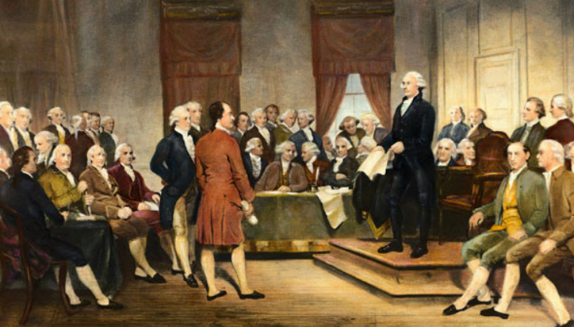
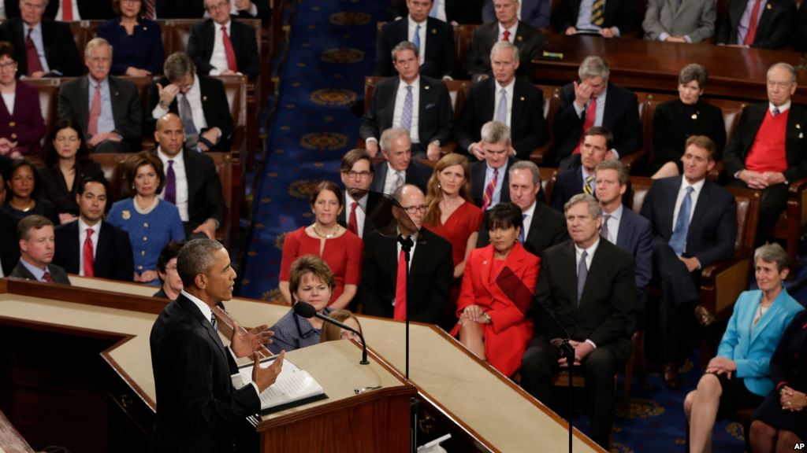
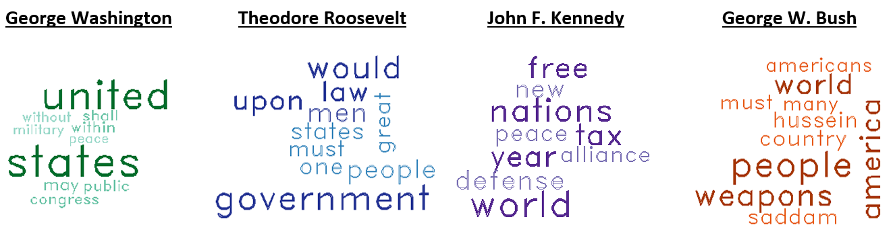

```{r echo=FALSE}
setwd('~/Desktop/EDAV/SOTU')
```

##I. Introduction
On January 8, 1790, President George Washington delivered the first annual State of the Union address to Congress in New York City. At the time, the United States was a newly formed nation, with a population of about 3.9 million. It was a time of new beginnings, and Washington's speech laid a positive foundation for the new government and presidency while touching on themes such as the separation of powers.^1^

Over two hundred years later, on January 13, 2016, President Barack Obama again a delivered State of the Union. However, the world is a little different now than it was in 1790. The US now has a population of 318.9 million, can fly planes in the sky, and the Internet exists. There have been times of war and times of peace, and we have been governed by many different leaders along the way.

Yet one thing has remained unchanged: every year, the president delivers the State of the Union speech to Congress.

In this project, you will experience the story that this corpus of two-hundred twenty-four speeches tells about the evolution of our nation. Among other topics, our text analysis provides insight to the personalities of some the greatest American leaders, visualizes how the foreign policy has evolved, and shows how the speech structures reflect a shifting American culture. 

<center>
<figure> 
 
 
</figure>
</center>

```{r echo=FALSE, include=FALSE}
### NOTE - image references.
# need to footnote them
# george: Declaration Made in America. http://www.declarationclothing.com/blogs/blog/7137068-george-washington-state-of-the-union
# obama: AP Photo/J. Scott Applewhite. VOA Learning English. http://learningenglish.voanews.com/a/state-of-the-union-2016/3142885.html
```

##II. Analysis Part 1 (Time??)
### War & Peace
We acquainted ourselves with the dataset by exploring two important key words: **war** and **peace**. After processing the text data into the Term Document Matrix (TDM), we were able to find word associations. The top terms correlated with **war** were _enemi_, _forc_, _shoot_, _air_, and _armi_. The top term associated with **peace** was _needfor_. In addition to finding associations in the TDM, we plotted the frequency of these words sequentially to get a sense of how the SOTU speeches have evolved over time. Our visualizations indicate peaks around the 150th SOTU speech, which was during the time of World War II, which lasted from 1939 to 1945. We see a peak in the frequency of the word **peace** just before WWII begins, and a peak in the word **war** a couple of years later. Placing these bar charts in context of larger world events shows the power of a simple visualization in telling a story.

```{r echo=FALSE, fig.width=9, fig.height=4, fig.align='center', warning=FALSE, message=FALSE}
library(RTextTools)
library(dplyr)
library(ggplot2)
library(gdata)

## Prepare the data
TOC <- read.csv('SOTU_table_of_contents.csv')

full <- read.table('State of the Union Addresses 1970-2016.txt',
                   quote="",
                   blank.lines.skip=FALSE,
                   fill=FALSE,
                   sep ='\n',
                   skipNul = FALSE)

## This part takes awhile to load 
docs <- c()
for (i in c(1:dim(TOC)[1])){
  SOTU <- drop.levels(full[TOC$Speech_Start_Line[i]:TOC$Speech_End_Line[i],])
  SOTU = as.vector(SOTU)
  # remove punctuation
  SOTU = gsub("[[:punct:]]", "", SOTU)
  # lowercase
  Text = tolower(paste(SOTU[which(SOTU!="")], collapse=" "))
  # stemming, whitespace 
  Word = wordStem(unlist(strsplit(Text, split=" ")), "english")
  docs <- cbind(docs, Word)
}

# War
nums <- 1:224
count.war <- c()
for (i in nums) {
  x <- length(which(docs[,i] == 'war'))
  count.war <- cbind(count.war, x)
}
count.war <- as.matrix(count.war)
count.war <- t(count.war)
count.war <- as.data.frame(count.war)
war <- ggplot(count.war, aes(x = nums, y = count.war$V1)) + geom_bar(stat='identity') + ggtitle('Frequency of Word "War"') + xlab('') + ylab('Count') 

# Peace
count.peace <- c()
for (i in nums) {
  p <- length(which(docs[,i] == 'peac'))
  count.peace <- cbind(count.peace, p)
}
count.peace <- as.matrix(count.peace)
count.peace <- t(count.peace)
count.peace <- as.data.frame(count.peace)
peace <- ggplot(count.peace, aes(x = nums, y = count.peace$V1)) + geom_bar(stat='identity') + ggtitle('Frequency of Word "Peace"') + xlab('Sequential Order of Speeches') + ylab('Count') 

# Plots
require(gridExtra) 
grid.arrange(war, peace, nrow=2)
```

```{r echo = FALSE, warning = FALSE, message = FALSE}
library(tm)
library(topicmodels)
library(wordcloud)
library(RColorBrewer)

## Prepare the data
#TOC <- read.csv('SOTU_table_of_contents.csv')

#full <- read.table('State of the Union Addresses 1970-2016.txt',
#                   quote="",
#                   blank.lines.skip=FALSE,
#                   fill=FALSE,
#                   sep ='\n',
#                   skipNul = FALSE)

docs <- c()
for (i in c(1:dim(TOC)[1])){
  SOTU <- droplevels(full[TOC$Speech_Start_Line[i]:TOC$Speech_End_Line[i],])
  SOTU = as.vector(SOTU)
  docs <- cbind(docs, SOTU)
}

# For each column, collapse the rows into one row. this becomes the document.
docs2 <- c()
for (i in 1:224) {
  docs2 <- cbind(docs2, paste(unlist(docs[,i]), collapse=""))
}

# Create a corpus
corp <- Corpus(VectorSource(docs2))

# Lowercase
corp <- tm_map(corp, content_transformer(tolower))

# Remove Whitespace
corp <- tm_map(corp, stripWhitespace)

# Create Term Document Matrix
tdm <- TermDocumentMatrix(corp,
                          control = list(stemming = TRUE, stopwords = TRUE, 
                                         minWordLength = 3, removeNumbers = TRUE, 
                                         removePunctuation = TRUE))

# Word Cloud
mTDM <- as.matrix(tdm)
v <- sort(rowSums(mTDM),decreasing=TRUE)
d <- data.frame(word = names(v),freq=v)
pal <- brewer.pal(9, "BuGn")
pal <- pal[-(1:2)]
png("wordcloud.png", width=1280,height=800)
wordcloud(d$word,d$freq, scale=c(8,.3),min.freq=2,max.words=100, random.order=T, rot.per=.15, colors=pal, vfont=c("sans serif","plain"))
```

``` {r echo = FALSE, include = FALSE}
### Code for word associations from War & Peace section
# which words are associated with 'war'?
findAssocs(tdm, "war", 0.31)

# which words are associated with 'peace'?
findAssocs(tdm, "peace", 0.39)
```

###Our Pronouns, Ourselves

In this section, we continue the use of temporal analysis, turning from the broad subjects of **war** and **peace** to a more meta-analytical look at how Presidents refer to themselves, the country, and the citizens thereof. Before examining the data, we hypothesized that there might be an increase in instances of first-person singular prounoun ("I","me","my","mine") usage; as the role of the United States presidency became an increasingly powerful position, perhaps those who held the office would insert themselves more frequently into their States of the Union addresses. 

Interestingly, the trend we see shows that while first-person singular prounoun usage has indeed increased in the past century, it has been greatly over-shadowed by the use of the first-person *plural* prounoun ("we","us","our","ours"). The trend is abundantly clear and persistent over the last 100 years. 

One might speculate that, with the advent of broadcast radio in the early 20th century (and later, television), the nature of the predsient's annual State of the Union address transformed from a mere "status report" to a unifiying, morale-boosting, identity-forging speech. 

Further interesting analysis along these lines might include noting differences in prounoun usage in election years vs. non-election years for 1st-term presidents.

```{r echo=FALSE, fig.width=9, fig.height=4, fig.align='center', warning=FALSE, message=FALSE}
 
# I/me/my/mine
nums <- 1:224
count.Me <- c()
for (i in nums) {
  w <- length(which(docs[,i] == 'I'))
  x <- length(which(docs[,i] == 'me'))
  y <- length(which(docs[,i] == 'my'))
  z <- length(which(docs[,i] == 'mine'))
  count.Me <- cbind(count.Me, w+x+y+z)
}
count.Me <- as.matrix(count.Me)
count.Me <- t(count.Me)
count.Me <- as.data.frame(count.Me)
Me <- ggplot(count.Me, aes(x = nums, y = count.Me$V1)) + geom_bar(stat='identity') + ggtitle('Frequency of "I/Me/My/Mine"') + xlab('') + ylab('Count') 

# You/your/yours/y'all
count.You <- c()
for (i in nums) {
  w <- length(which(docs[,i] == 'you'))
  x <- length(which(docs[,i] == 'your'))
  y <- length(which(docs[,i] == 'yours'))
  z <- length(which(docs[,i] == "y'all"))
  count.You <- cbind(count.You, w+x+y+z)
}
count.You <- as.matrix(count.You)
count.You <- t(count.You)
count.You <- as.data.frame(count.You)
You <- ggplot(count.You, aes(x = nums, y = count.You$V1)) + geom_bar(stat='identity') + ggtitle('Frequency of "You/Your/Yours/Y\'all"') + xlab('') + ylab('Count') 

# We/us/our/ours
count.We <- c()
for (i in nums) {
  w <- length(which(docs[,i] == 'we'))
  x <- length(which(docs[,i] == 'us'))
  y <- length(which(docs[,i] == 'our'))
  z <- length(which(docs[,i] == 'ours'))
  count.We <- cbind(count.We, w+x+y+z)
}
count.We <- as.matrix(count.We)
count.We <- t(count.We)
count.We <- as.data.frame(count.We)
We <- ggplot(count.We, aes(x = nums, y = count.We$V1)) + geom_bar(stat='identity') + ggtitle('Frequency of "We/Us/Our/Ours"') + xlab('') + ylab('Count')

# America/America's/Americans/Americans'
count.America <- c()
for (i in nums) {
  w <- length(which(docs[,i] == 'america'))
  x <- length(which(docs[,i] == "america's"))
  y <- length(which(docs[,i] == 'american'))
  z <- length(which(docs[,i] == 'americans'))
  xx <- length(which(docs[,i] == "americans'"))
  count.America <- cbind(count.America, w+x+y+z+xx)
}
count.America <- as.matrix(count.America)
count.America <- t(count.America)
count.America <- as.data.frame(count.America)
America <- ggplot(count.America, aes(x = nums, y = count.America$V1)) + geom_bar(stat='identity') + ggtitle('Frequency of "America/America\'s/American/Americans/Americans\'"') + xlab('') + ylab('Count')


# They/Them/Their/Theirs
count.They <- c()
for (i in nums) {
  w <- length(which(docs[,i] == 'they'))
  x <- length(which(docs[,i] == 'them'))
  y <- length(which(docs[,i] == 'their'))
  z <- length(which(docs[,i] == 'theirs'))
  count.They <- cbind(count.They, w+x+y+z)
}
count.They <- as.matrix(count.They)
count.They <- t(count.They)
count.They <- as.data.frame(count.They)
They <- ggplot(count.They, aes(x = nums, y = count.They$V1)) + geom_bar(stat='identity') + ggtitle('Frequency of "They/Them/Their/Theirs"') + xlab('') + ylab('Count')


#Country/Country's/Nation/Nation's
count.Country <- c()
for (i in nums) {
  w <- length(which(docs[,i] == 'country'))
  x <- length(which(docs[,i] == "country's"))
  y <- length(which(docs[,i] == 'nation'))
  z <- length(which(docs[,i] == "nation's"))
  count.Country <- cbind(count.Country, w+x+y+z)
}
count.Country <- as.matrix(count.Country)
count.Country <- t(count.Country)
count.Country <- as.data.frame(count.Country)
Country <- ggplot(count.Country, aes(x = nums, y = count.Country$V1)) + geom_bar(stat='identity') + ggtitle('Frequency of "Country/Nation/Country\'s/Nation\'s\'"') + xlab('') + ylab('Count') 


# Plots
require(gridExtra) 

grid.arrange(Me, We, nrow=2)
```

Similar to the above two plots, here we examine the relative usage of the pronouns "you" and "they". While neither is wholly remarkable, what becomes very interesting to investigate are the anomalies in frequency. For example, on the "You" plot below, we see one State of the Union Address, number 175 (Lyndon B. Johnson, 1966), where the frequency of "you" explodes. 

In this speech, Johnson employs the following structural style:

> I recommend that you provide...

and

> I recommend that you make it possible ...

and 
 
> I recommend that you meet the growing menace of crime ...

This makes it seem conversational -- he is asking his listeners (the American people as well as the legislature) for help in accomplishing a list of goals. It also casts him in a very passive, almost non-threatening light. He is presenting himself as a public servant, and not as a domineering leader. Eventually, he summarizes his pleas with this eloquent paragraph:

> I have not come here tonight to ask for pleasant luxuries or for idle   
> pleasures. I have come here to recommend that you, the representatives  
> of the richest Nation on earth, you, the elected servants of a people   
> who live in abundance unmatched on this globe, you bring the most urgent
> decencies of life to all of your fellow Americans.

```{r echo=FALSE, fig.width=9, fig.height=4, fig.align='center', warning=FALSE, message=FALSE}
grid.arrange(You, They, nrow=2)
```

Here, we see the relative usage of the following groups of terms: ("country/nation") and ("America/American"). The most obvious observation is that, within the last 50 years, presidents have been using "America(n)" far more frequently. 

```{r echo=FALSE, fig.width=9, fig.height=4, fig.align='center', warning=FALSE, message=FALSE}
grid.arrange(Country, America, nrow=2)
```


##III. Topic Analysis
In this part, we did topic analysis over the speeches of presidents using LDA. We first discovered the possible five topics among all speeches. Each speech will be assigned to a topic. The related words of each topic will aslo show in the legend of each plot. We then discovered the topics of speeches for both Republican and Democrat presidents. We expect some differences between the topics for different parties. 

```{r echo=FALSE, warning=FALSE, message=FALSE}
library(tm)
library(topicmodels)
library(RTextTools)
library(ggplot2)
library(rJava)

#setwd('~/Desktop/EDAV/SOTU')
speech = read.csv("Word_Document_Matrix.csv", na.strings = "NA")
nouns = read.table("nouns.txt")
noun = as.character(nouns$V1)
nouns = read.delim("nouns.txt", sep = "\n")
docinfo = read.csv('SOTU_table_of_contents.csv')
Year = as.vector(docinfo$Year)

#dim(speech)
#colnames(speech)
#getSources()

#speech_x = as.TermDocumentMatrix(speech,weighting = weightTf)
#dim(speech_x)
#inspect(speech_x[1:5,1:5])

#as.integer(as.character(speech[2,2]))

#remove stopwords like "a"
rownames(speech) = as.character(speech$Word)
speech = speech[,-1]
speech_new = speech[ !(rownames(speech) %in% stopwords('en')), ] 
#write(rownames(speech_new),"words.txt")

#remove verbs
#write(rownames(speech_new),"words.txt")
#rownames(speech_new)
speech_noun = speech_new[ (rownames(speech_new) %in% as.character(noun)), ]

for (i in range(1:dim(speech_noun)[2])){
  as.numeric(speech_noun[,i])
}

speech_noun_t = as.data.frame(t(speech_noun))
mlda = LDA(speech_noun_t,k=5)
mterms = terms(mlda,20)[10:15,]
mterms = apply(mterms,MARGIN=2,paste,collapse=', ')

# First topic identified for every document
mtopic = topics(mlda,1)
mtopics = data.frame(Year=Year,topic1=mtopic)
```
```{r echo=FALSE, fig.width=9, fig.height=4, fig.align='center', warning=FALSE}
qplot(Year,..count..,data=mtopics,geom='density',fill=mterms[mtopic],position='stack', alpha=I(0.3)) + 
  ggtitle("Top 5 Topics Distribution") +
  scale_fill_discrete( "Topic Key Words") + ylab("% Frequency of Topic being in the Speech") +
  theme(legend.position="top", axis.title=element_text(size=10)) +
  guides(fill=guide_legend(title.theme = element_text(size=10, angle = 0), title.position = "top", nrow=2,byrow=TRUE))
```
Next, we would like to study the topics in the State of the Union speech texts by party and try to discover the difference between the Republican and Democratic leaders.

```{r echo=FALSE,include=FALSE}
party = read.csv("USPresident-Wikipedia-URLs-Thmbs-HS.csv")
speech_pred = read.csv("SOTU_table_of_contents.csv")
party = as.data.frame(party)


speech_party = merge(x= speech_pred, y= party, by = "President", all.x = TRUE )
demo = speech_noun[,grep("Demo",as.character(speech_party$Party))]
repu = speech_noun[,grep("Rep",as.character(speech_party$Party))]

#the topic for democratic president
demo_noun_t = as.data.frame(t(demo))
mlda = LDA(demo_noun_t,k=5)
mterms = terms(mlda,20)[10:15,]
mterms = apply(mterms,MARGIN=2,paste,collapse=', ')

mtopic = topics(mlda,1)
mtopics = data.frame(doc=1:101,topic1=mtopic)
```

```{r echo=FALSE, fig.width=9, fig.height=4, fig.align='center', warning=FALSE}
qplot(doc,..count..,data=mtopics,geom='density',fill=mterms[mtopic],position='stack',alpha=I(0.3)) +
  ggtitle("Democratic Presidents - Top 5 Topics") +
  scale_fill_discrete( "Topic Key Words") + ylab("% Frequency of Topic being in the Speech") +
  theme(legend.position="top", axis.title=element_text(size=10)) + 
  guides(fill=guide_legend(title.theme = element_text(size=10, angle = 0), title.position = "top", nrow=2,byrow=TRUE))
```

```{r echo=FALSE,include=FALSE}
#the topic for republican president
repu_noun_t = as.data.frame(t(repu))
mlda = LDA(repu_noun_t,k=5)
mterms = terms(mlda,20)[10:15,]
mterms = apply(mterms,MARGIN=2,paste,collapse=', ')

mtopic = topics(mlda,1)
mtopics = data.frame(doc=1:104,topic1=mtopic)
```

```{r echo=FALSE, fig.width=9, fig.height=4, fig.align='center', warning=FALSE}
qplot(doc,..count..,data=mtopics,geom='density',fill=mterms[mtopic],position='stack',alpha=I(0.3)) +
  ggtitle("Republican Presidents - Top 5 Topics") +
  scale_fill_discrete( "Topic Key Words") + ylab("% Frequency of Topic being in the Speech") +
  theme(legend.position="top", axis.title=element_text(size=10)) + 
  guides(fill=guide_legend(title.theme = element_text(size=10, angle = 0), title.position = "top", nrow=2,byrow=TRUE))
```

As we can see that the topic key words are clearly different between the presidents from the two parties. Some key words from the Democratic presidents' speeches are congress, power, war, peace, etc. Some key words from the Republican presidents' speeches are secure, power, work, tax, constitutes, etc. However, for both parties, there is definitely more diversity among topics nowadays than 150 years ago.


##IV. Personality Analysis for 6 Presidents

In this part, we select 6 presidents and study their personalities based on the Personality Insights analysis from IBM Watson. We not only want to compare different individual presidents' personalities, but also would like to see the time/generation difference. So we picked the presidents in two groups: those before the 1940s and those after the 1990s. We would like to compare if the presidents demonstrate strong personality differences through their State of the Union speeches, and if the presidents from different times tend to show some common features. So we choose George Washington, Thomas Jefferson, Franklin D. Roosevelt, William J. Clinton, George W. Bush and Barack Obama.

The IBM Watson Personality Insights takes people's writing text as input and gives analysis about personality Big 5, Values, and Needs as the output. The analysis works well on text with more than 3,500 words. For each president, we combine all his State of the Union speech documents into one. Hence we have large enough corpus for each president to get very strong analysis results from the application.

We use most of the analysis results in our visualization. Let's first look at the definitions for the categories. We quote the official definition form IBM Watson here (http://www.ibm.com/smarterplanet/us/en/ibmwatson/developercloud/doc/personality-insights/basics.shtml):
 
* <b>Big Five </b> personality characteristics represent the most widely used model for generally describing how a person engages with the world. The model includes five primary characteristics, or dimensions:
     * Agreeableness is a person's tendency to be compassionate and cooperative toward others.
     * Conscientiousness is a person's tendency to act in an organized or thoughtful way.
     * Extraversion is a person's tendency to seek stimulation in the company of others.
     * Emotional Range, also referred to as Neuroticism or Natural Reactions, is the extent to which a person's emotions are sensitive to the person's environment.
     * Openness is the extent to which a person is open to experiencing a variety of activities.
* <b>Needs</b> describe which aspects of a product will resonate with a person.
* <b>Values</b>  describe motivating factors that influence a person's decision making. 

We summarize all test results in the following table. The color range from dark read to dark green is corresponding to the 0% to 100% percentile.

<center>  </center>

From the table we can see some obvious features. First of all, Agreeableness changes a lot over time. The 3 presidents before the 1940s tend to have very low Agreeableness comparing with the most recent ones. One of the reasons could be that the major issues the US is dealing with nowadays are very different from the early time. Presidents during war time tend to have low agreeableness. The other reason might be that the change of language usage over time affects the test results. It is possible that the Watson system's analysis is more based on modern languages and standards. Another obvious pattern is that the analyses of Franklin Roosevelt and George W. Bush show similar patterns. We would like to point out another interesting finding: all 6 presidents reveal very similar Values. This means that the general values shown in the Union of the State speeches stay the same over time.

After interpreting the table, we visualize the information for different presidents on the following 2 radar plots. We omit the Value information here, because all 6 president show almost identical patterns for the Value analysis. 

The first radar plot shows the Big 5 Personality percentiles. We can see that the scores for Openness and Conscientiousness are similar for all 6 presidents. Agreeableness and Introversion/Extraversion have larger variation across the presidents. It is also very clear that the most recent presidents tend to show more Agreeableness, Emotional Range and Introversion in their Union of the State speech than the presidents before 1940s. There is a clear shift from the left side to the right side of the graph: from higher openness and conscientiousness towards higher agreeableness, emotional range, and introversion,

<center> <h4> <b> Personality Insights - Big 5 Personality Percentiles for 6 Presidents </b> </h4> </center>

<iframe width="100%" height="550" src="./YF_Personality_Insights_Personality.html" frameborder="0" allowfullscreen></iframe>


<center> <h4> <b> Personality Insights - (Consumer) Needs Percentiles for 6 Presidents </b> </h4> </center>

<iframe width="100%" height="550" src="./YF_Personality_Insights_Consumer_Needs.html" frameborder="0" allowfullscreen></iframe>


From the above radar plot for Needs, we can clearly that the 6 presidents can be divided into 3 groups based on these standards. George Washington and Thomas Jefferson have similar patterns with very high consumer needs in challenge and comparatively low needs in the others. The distribution patterns for William J. Clinton and Barack Obama are almost identical: high love, practicality, harmony and very low need for challenge, ideal and self-expression. Franklin D. Roosevelt tend to have similar patterns and hive very high percentiles in almost all categories. One of the interpretation could be that the speech of presidents during peace time can be very different from those during the war time.

With these plots and personality analyses, we are able to see what kind of values and personalities the presidents show through their State of the Union speeches. These may not be the same as their real personality, however, these are the interpretation of their personalities as presidents of the United States.

##V. K-Means Clustering   
We use a K-Means cluster analysis to see which speeches are similar to each other and use Pricinple Component Analysis to reduce dimensions and provide a visual representation of the cluster space. It is easy to see the same early level clusters among party and era combined. Speeches made by the same president are always clustered together. Also, speeches from the same Political Party and Era are commonly next to each other (Obama & Clinton, Reagan & Bush Sr., Eisenhower & Truman).     
```{r,echo=FALSE, warning=FALSE, message=FALSE}
tf_idf_mat = t(speech_new)
tf_idf_dist <- dist(tf_idf_mat)
dist_mat <- as.matrix(tf_idf_dist)
tf_idf_norm <- tf_idf_mat / apply(tf_idf_mat, MARGIN = 1, FUN = function(x) sum(x^2)^0.5)
km_clust <- kmeans(x = tf_idf_norm, centers = 4, iter.max = 25)
pca_comp <- prcomp(tf_idf_norm)
pca_rep <- data_frame(sotu_name = paste(TOC$President, TOC$Year),
                      pc1 = pca_comp$x[,1],
                      pc2 = pca_comp$x[,2],
                      clust_id = as.factor(km_clust$cluster))
library(plotly)
plot_ly(pca_rep, x = pc1, y = pc2, text = sotu_name, mode="markers", color = clust_id) %>% layout(title = 'K-Means Cluster: 4 President clusters on PCA Features')
```

##VI. Foreign Policy   
When names of countries get mentioned during the speeches, it is usually that they demand national attention which reflect the foreign policy at that time. The instances of country names point to contemporaneous events. We can see the almost isolated reference of Vietnam in the 1960s (the Vietnam War), the bubbling of “Korea” in the 1950s (the Korean War), the rise and fall of soviet between 1945 and 1991, and the rise in “Iraq,” “Iran” and “Afghanistan” mentions in recent decades.       
```{r,echo=FALSE, warning=FALSE, message=FALSE}
library(reshape2)
library(RColorBrewer)
countries = speech[c("iran","afghanistan", "iraq", "korea", "vietnam", "german", "japan","soviet", "russia"),]
colnames(countries) = TOC$Year
countries$id = rownames(countries)
countries = melt(countries)
colnames(countries) = c("country", "year", "count")
# cols <- colorRampPalette(brewer.pal(7, "Set1"))
# myPal <- cols(nlevels(TOC$President))
plot_ly(countries, x = year, y = country, size = count, text = TOC$President, mode="markers") %>% layout(title = 'Foreign Policy among the time')
```

##VIII. The Presidents' Lexicon
In this section we will analyze how the linguistic structure of the SOTU speeches have evolved over time. In particular, we will investigate if they have gotten simpler or they became more complex. The proxy we will use for this is a fairly straight forward one: we will measure the average length of sentences in each speech, and also the number of unique words on them. In both cases a greater number implies greater complexity. The reference code for this analysis is located at the `text_analysis.ipynb` file.

We start by looking at the average sentence length of the SOTU's.

```{r,echo=FALSE, warning=FALSE, message=FALSE}
sotu.summary <- read.csv("sotu_df.csv")

ggplot(data = sotu.summary, aes(x= Year, y = Length)) + geom_line() + stat_smooth() +
  ggtitle("Average # Words in Sentence") + theme_classic()
```

There is clearly a downward trend in sentence length, implying that the speeches are becoming 'simpler' over time. This is not so much of a surprise as similar analysis done on other cultural sources, such as musical lyrics and newspaper articles show the same trend, so this is most likely the result of a cultural shift.

Now, how does this compare to the number of unique words used on each speech? To make the analysis more relevant we remove all stopwords from the corpus.

```{r,echo=FALSE, warning=FALSE, message=FALSE}
ggplot(data = sotu.summary, aes(x= Year, y = Uniques)) + geom_line() + stat_smooth() +
  ggtitle("# Unique Words in Sentence") + theme_classic()
```

Interestingly there is not a clear pattern on this measure, which is probably indicative of the variable being more sensitive to who is giving the speech rather than when it was given. What if we look at individual presidents, and evaluate their average vocabulary length instead? We will only consider presidents with more than four speeches (i.e. popular ones) to not overwhelm the reader.

```{r,echo=FALSE, warning=FALSE, message=FALSE}
sotu.summary %>%
  group_by(President) %>%
  summarise(count = n(), Unique = mean(Uniques)) %>%
  filter(count > 4) %>%
  ggplot() + geom_bar(aes(x=reorder(President, Unique), y=Unique), stat = "identity") +
  ggtitle("Unique Words by President (>1 Term)") +
  xlab("") + 
  coord_flip() + theme_classic()
```

We see that George Washington had a relatively limited vocabulary, while Roosevelt was the most well-versed one. Looking at recent presidents, we see that Obama ranks relatively high, while W. Bush lies on the middle of the table.

Finally we will look at the favorite words for some selected presidents, specifically: George Washington, Theodore Roosevelt, John F. Kennedy, and George W. Bush. The favorite words are the most mentioned ones on their speeches.

<center>  </center>

```{r,echo=FALSE, warning=FALSE, message=FALSE}
#library(RXKCD)
#library(tm)
#library(wordcloud)
#library(RColorBrewer)

#washington <- read.csv("Presidents/GeorgeWashington.csv")
#theodore <- read.csv("Presidents/TheodoreRoosevelt.csv")
#bush <- read.csv("Presidents/GeorgeWBush.csv")
#kennedy <- read.csv("Presidents/JohnFKennedy.csv")
#kennedy <- kennedy[2:nrow(kennedy),]

## Pallete
#pal <- brewer.pal(4, "BuGn")
#pal <- pal[-(1:2)]

## Washington
#png("Presidents/washington.png", width=640,height=400)
#wordcloud(words = washington$X, freq = washington$George.Washington,
#          scale=c(5,.3),min.freq=2,max.words=100,
#          random.order=T, rot.per=.15, colors=pal, vfont=c("sans serif","plain"))
#dev.off()

## Roosevelt
#png("Presidents/theodore.png", width=640,height=400)
#wordcloud(words = theodore$X, freq = theodore$Theodore.Roosevelt,
#          scale=c(5,.3),min.freq=2,max.words=100,
#          random.order=T, rot.per=.15, colors=pal, vfont=c("sans serif","plain"))
#dev.off()

## Bush
#png("Presidents/bush.png", width=640,height=400)
#wordcloud(words = bush$X, freq = bush$George.W..Bush,
#         scale=c(5,.3),min.freq=2,max.words=100,
#         random.order=T, rot.per=.15, colors=pal, vfont=c("sans serif","plain"))
#dev.off()

## Kennedy
#png("Presidents/kennedy.png", width=640,height=400)
#wordcloud(words = kennedy$X, freq = kennedy$John.F..Kennedy,
#        scale=c(5,.3),min.freq=2,max.words=100,
#        random.order=T, rot.per=.15, colors=pal, vfont=c("sans serif","plain"))
#dev.off()


```

##VIII. Conclusion

Thank you, God bless you. God bless the United States of America.

##Reference
[1] Radar Plot: http://bl.ocks.org/nbremer/6506614
